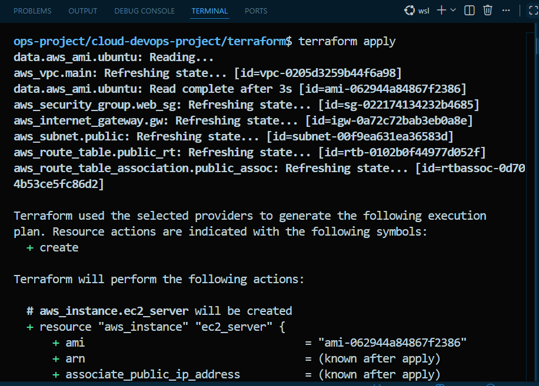
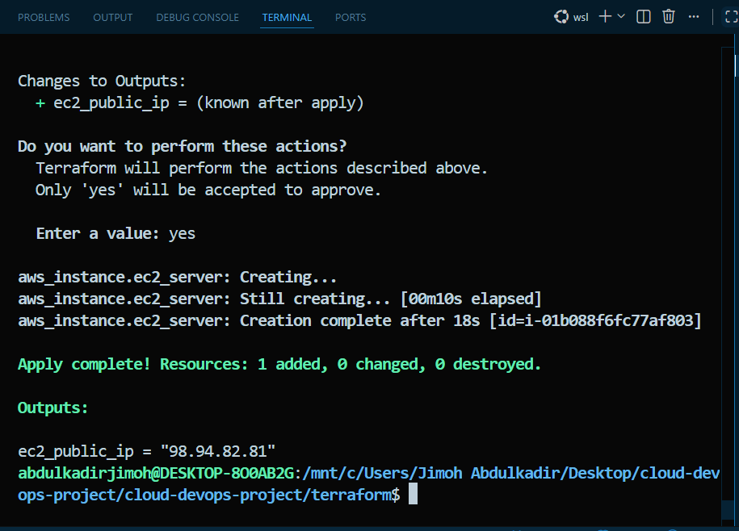
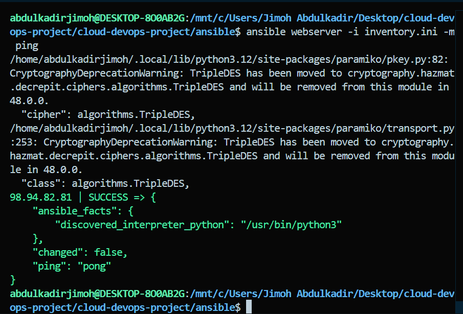
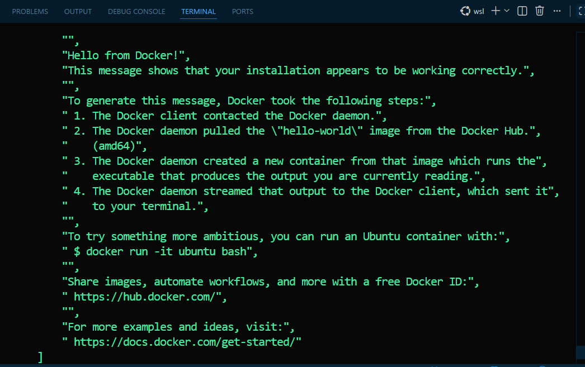
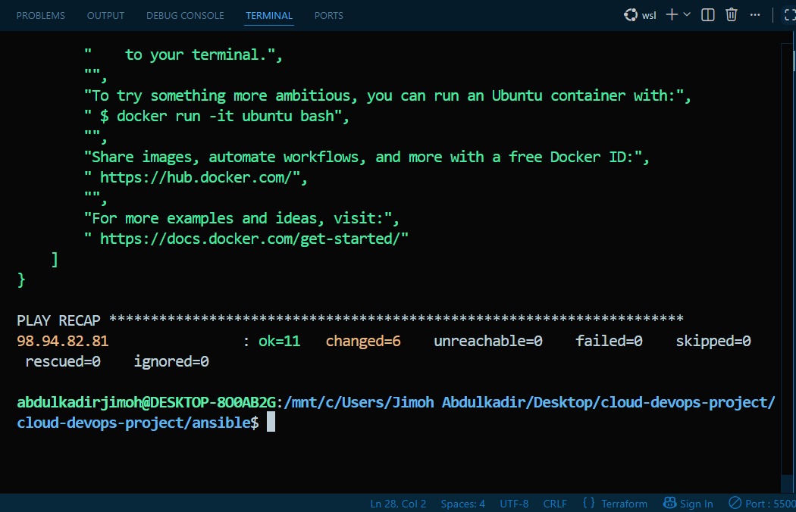

# Cloud & DevOps Infrastructure Automation Project

This project automates the provisioning of AWS cloud infrastructure using Terraform and configures the environment with Ansible to deploy Docker Engine.

## Architecture & Specifications

- **Cloud Provider:** AWS (`us-east-1`)
- **Compute Instance:** EC2 `t3.micro` (Ubuntu 22.04 LTS Jammy)
- **Networking:** Custom VPC with Public Subnet and Security Group (Ports 22, 80, 443 enabled)
- **Configuration Management:** Ansible
- **Container Runtime:** Docker Engine & Docker CLI

## Deployment Steps

### 1. Provision Infrastructure with Terraform
```bash
cd terraform
terraform init
terraform plan
terraform apply
```

### 2. Configure Server & Deploy Docker with Ansible
```bash
cd ../ansible
ansible-playbook -i inventory.ini playbook.yml
```

## Verification
- Connection tested using `ansible webserver -i inventory.ini -m ping`
- Docker Engine installation verified on remote host by running the `hello-world` test container via Ansible playbook automation.

## 📸 Deployment Evidence & Screenshots

### 1. Infrastructure Provisioning (Terraform)



### 2. AWS Management Console


### 3. Ansible Automation & Docker Verification


